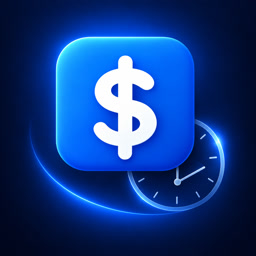
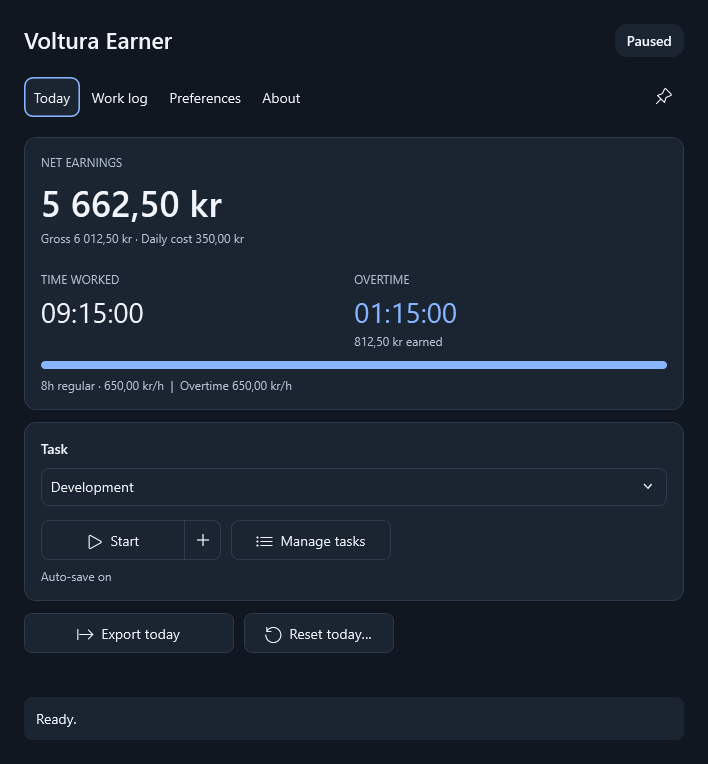
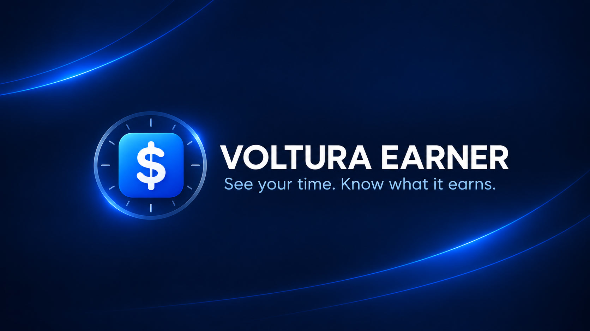
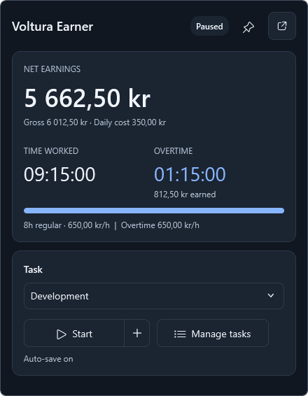

<section class="hero" aria-labelledby="hero-title">
  

    

      
      
For Windows

    

    <h1 id="hero-title">See your time. Know what it earns.</h1>
    
Voltura Earner keeps your tasks, time, and earnings together in a small Windows companion. Track your regular day and keep going into overtime.

    

      <a class="button button-primary" href="#download">Get Voltura Earner</a>
      <a class="button button-secondary" href="https://github.com/voltura/voltura-earner">View on GitHub</a>
    

    
Windows · Free and open source · No account

  

  

    

      
      
<strong>Your working day, in view</strong>One click beside the clock opens your live earnings.

    

    <figure class="app-window">
      
      <figcaption>Your time and earnings, together in one clear view.</figcaption>
    </figure>
  

</section>

<section class="section video-intro" aria-labelledby="video-title">
  
  

    
See it in action

    <h2 id="video-title">Meet your working-day companion.</h2>
    
A quick look at tasks, live earnings, overtime, and reports, using sample work data.

    <a class="button button-primary" href="https://youtu.be/h_hQxaHeKA0">Watch the 70-second tour</a>
    
<a href="https://www.youtube.com/@voltura-earner">More from Voltura Earner on YouTube</a>

  

</section>

<section class="section section-intro" aria-labelledby="why-title">
  

A clearer working day
<h2 id="why-title">Keep track as you work.</h2>
Choose a task, start tracking, and let Earner handle the totals.

  

    <article class="feature-card feature-card-primary">01<h3>Live earnings</h3>
See gross and net earnings with your hourly rate, currency, and fixed daily cost.
</article>
    <article class="feature-card">02<h3>Overtime included</h3>
Choose what happens at your daily limit: stop tracking, continue at your normal rate, or use a separate overtime rate.
</article>
    <article class="feature-card">03<h3>A useful work log</h3>
Track up to 40 tasks, correct individual entries, and export clear Excel reports.
</article>
  

</section>

<section class="section calendar-preview" aria-labelledby="live-title">
  

    

Beside the Windows clock
<h2 id="live-title">Your earnings, one click away.</h2>
Left-click the tray icon for a compact live view of your earnings, time, and current task.

    
Start or pause directly from the popup. It shares the same work session as the main window, so switching views keeps everything together.

    
Drag the header to move it beside your work. Pin it to keep it open above other windows. The pin is independent of the main window.

    
Click the icon again or press Escape to hide it. Clicking elsewhere hides it when it is unpinned. Reopening restores its position beside the tray.

  

  <figure class="app-window"><figcaption>A movable view that stays when you pin it.</figcaption></figure>
</section>

<section class="section capabilities" aria-labelledby="capabilities-title">
  

More when you need it
<h2 id="capabilities-title">Useful tools. Kept simple.</h2>

  

    <article class="capability-card">Track<h3>Tasks and working time</h3>
Switch tasks, pause for a break, and resume when you are ready. New app sessions start paused.
</article>
    <article class="capability-card">Understand<h3>Gross, cost, and net</h3>
Deduct your fixed daily cost once per day. Historical rates and currencies remain attached to their entries.
</article>
    <article class="capability-card">Review<h3>Editable history</h3>
See daily totals for each task. Add missing work, review individual entries, or remove a mistake. Editing pauses tracking.
</article>
    <article class="capability-card">Export<h3>Excel reports</h3>
Export today, this week, month, year, or all history. Reports include regular time, overtime, and separate currency totals.
</article>
    <article class="capability-card">Personalize<h3>Your workflow</h3>
Choose from 21 languages, light or dark appearance, storage folders, startup behavior, notifications, and automatic reports.
</article>
    <article class="capability-card">Maintain<h3>Verified updates</h3>
Installed copies can download verified updates. You choose when to save your work, install, and restart.
</article>
  

</section>

<section class="section essentials" aria-labelledby="essentials-title">
  

Small and practical
<h2 id="essentials-title">Room for your actual work.</h2>

  

    
<strong>Works offline</strong>Tracking and Excel exports need no connection.

    
<strong>Looks at home</strong>Light, dark, or system appearance with themed inputs and rounded tooltips.

    
<strong>Stays responsive</strong>Saving and report generation run away from the UI thread.

    
<strong>Keeps data local</strong>No account, cloud storage, or usage analytics.

  

</section>

<section class="section download" id="download" aria-labelledby="download-title">
  

Get Voltura Earner
<h2 id="download-title">Start with a clearer day.</h2>
The first release is being prepared. Published packages will appear on the releases page. You can also build the current source using the contributing guide.
<a class="button button-primary" href="https://github.com/voltura/voltura-earner/releases">View releases</a>

  

    <article class="package recommended">
Recommended<h3>Standard installer</h3>

A smaller download. Installs the Microsoft .NET 10 Desktop Runtime if needed.
<code>Setup-…-win-x64.exe</code></article>
    <article class="package">
<h3>Offline installer</h3>

Includes the runtime, without a separate runtime download.
<code>Setup-…-win-x64-full.exe</code></article>
    <article class="package">
<h3>Portable ZIP</h3>

Extract to a writable folder and run without installation.
<code>…-win-x64.zip</code></article>
  

</section>

<section class="section setup" aria-labelledby="setup-title">
  

Getting started
<h2 id="setup-title">Three simple steps.</h2>

  <ol class="steps">
    <li>1
<strong>Set your working day</strong>
Choose an hourly rate, daily cost, currency, and regular hours in Preferences.

</li>
    <li>2
<strong>Choose a task and start</strong>
Start tracking from Today or the live tray window. Pause when you stop working.

</li>
    <li>3
<strong>Review and export</strong>
Use Work log to review your entries and save an Excel report for the period you need.

</li>
  </ol>
</section>

<section class="section details" aria-label="More information">
  

Overtime, sleep, and a new day

At your daily limit, Earner follows your overtime preference: stop, continue at the normal rate, or use a different overtime rate. Tracking pauses at midnight and when Windows goes to sleep. Open or restart the app when you are ready, then explicitly start tracking. Time spent paused is not counted.

  

Existing Earner users

Voltura Earner is a fresh WPF application with its own settings and work history. It does not import or modify the original Earner app's data.

  

Updates and privacy

Installed copies can check for signed updates and download them automatically; you choose when to install. Installing an update saves your work and closes Earner; reopen it if you cancel setup. Exit Earner before running a downloaded installer or uninstaller. Portable copies use manual downloads.

Your work stays on your computer. Update checks contact GitHub, and the standard installer may download the runtime from Microsoft. Read the <a href="https://github.com/voltura/voltura-earner/blob/main/PRIVACY.md">privacy policy</a>.

  

Help and project information

    <a href="https://github.com/voltura/voltura-earner/issues/new?template=bug_report.yml">Report a bug</a>
    <a href="https://github.com/voltura/voltura-earner/blob/main/CONTRIBUTING.md">Contributing and building from source</a>
    <a href="https://github.com/voltura/voltura-earner/blob/main/docs/architecture.md">Architecture</a>
    <a href="https://github.com/voltura/voltura-earner/blob/main/docs/validation.md">Validation guide</a>
    <a href="https://github.com/voltura/voltura-earner/blob/main/SECURITY.md">Security policy</a>
    <a href="https://github.com/voltura/voltura-earner/blob/main/LICENSE">MIT License</a>
  

</section>

<section class="project-strip" aria-label="Project and support">
  

  
<a href="https://www.paypal.com/donate?hosted_button_id=7PN65YXN64DBG">Support Voltura</a> · <a href="https://ko-fi.com/G2G74W5F8">Buy me a coffee</a>

</section>
